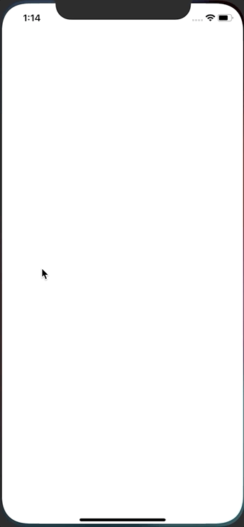

# progressBar

Implementation of a progress bar in Swift.

Progress bars are custom Views (ProgressBarView.swift) added to container views placed on the Storyboard via ViewController.swift.

Colors can be passed in for customization. The bars can be static or animated.

The bars also automatically take the width of their container view.

